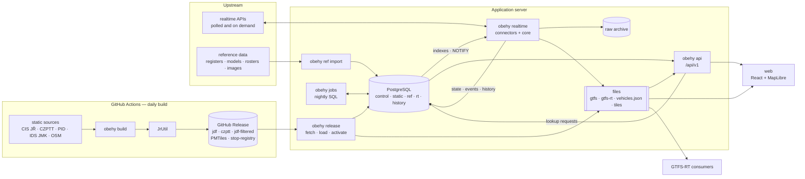
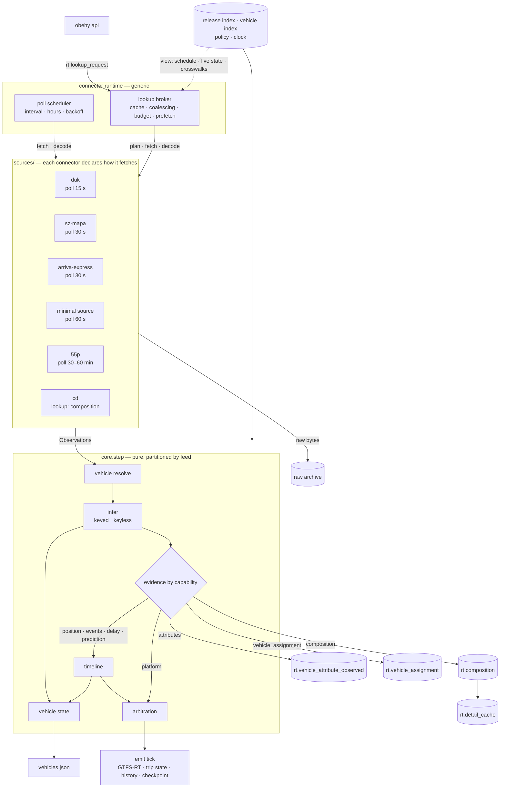
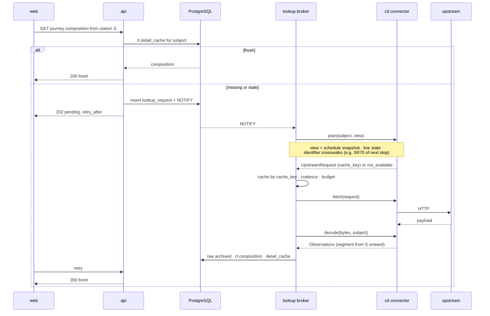
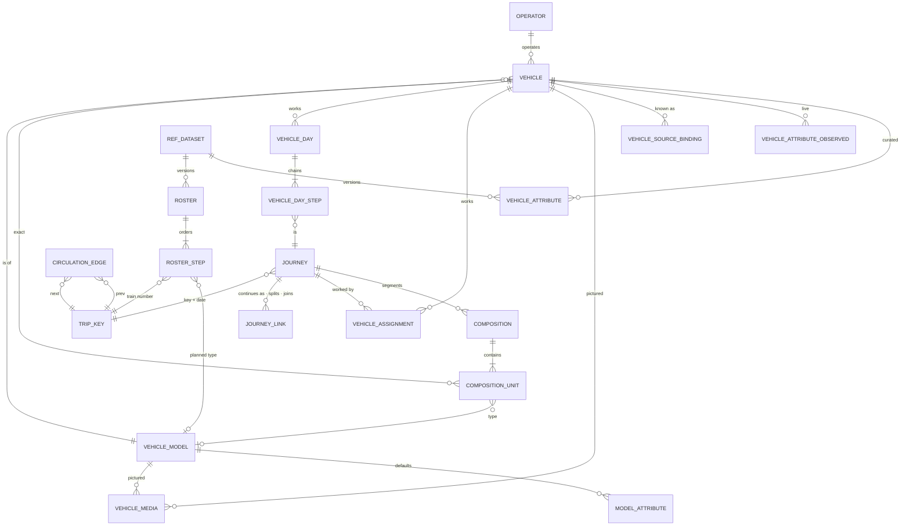
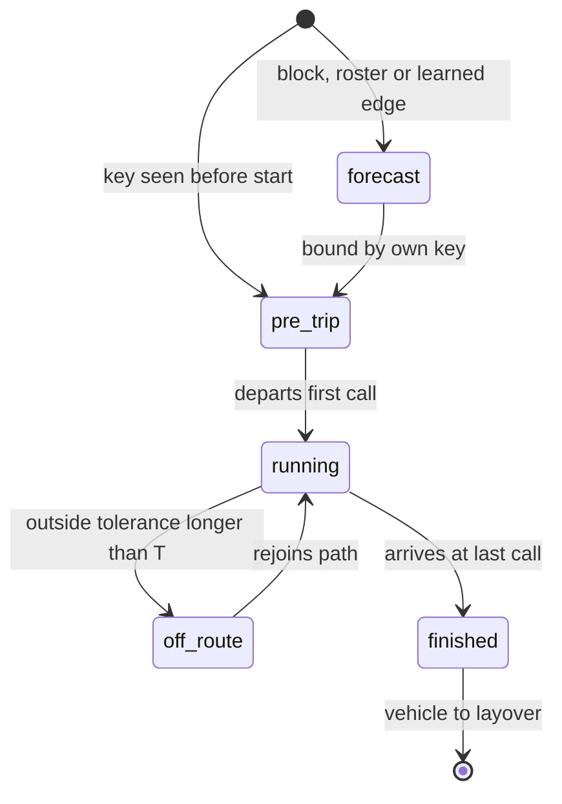

# Oběhy architecture

The diagrams and the cross-cutting contracts of the application. `BASE_PLAN.md` holds the
reasoning and the detail of each part; this document is the map. Section references (§) are to
`BASE_PLAN.md`.

## System overview



| Process | Role |
|---|---|
| `obehy build` (GitHub Actions) | the only static compiler, through JrUtil (§11, §15) |
| `obehy release` | fetch, verify, load and activate releases into `static.*` (§16) |
| `obehy ref import` | load curated reference datasets into `ref.*` |
| `obehy realtime` | the one process that talks to realtime upstreams; connectors plus the pure core (§18) |
| `obehy jobs` | nightly set-wise SQL: `vehicle_day`, circulation edges, punctuality, retention |
| `obehy api` | FastAPI `/api/v1`; never calls upstream |

PostgreSQL schemas:

- `control`: releases, loads, publications.
- `static`: the serving relations per load, read through `active.*`.
- `ref`: curated reference datasets, a mirror of reviewed files.
- `rt`: observations, assignments, current state, lookups.
- `history`: journeys, actual events, vehicle days, the circulation model.

## Two kinds of input

| | Connector (`realtime/sources/`) | Importer (`reference/importers/`) |
|---|---|---|
| what | live data: positions, delays, events, assignments, compositions | reference datasets: vehicle registers, models, bindings, rosters, media |
| when | polled channels, or lazy lookups on demand | when the reviewed files change |
| output | `Observation`s into the core; raw bytes archived | a versioned snapshot loaded set-wise into `ref.*` |
| replay | from the raw archive | history names the dataset version it used |

Curated data is authored as **git-reviewed files** (like the stop registry) and imported; `ref.*`
is a mirror, never a source of truth. Public datasets live in `jrunify-ext-geodata/vehicles/`.
Private ones (such as the DÚK vehicle register) use the same format from a local path in
`obehy.local.toml` and are never committed. The app accepts no human input.

## Connector contract

A connector is `realtime/sources/<source>.py` plus `<source>.toml`. **It declares how it
fetches; the generic connector runtime (`realtime/runtime/`) executes that.** No connector
implements scheduling, rate limits, budgets or caching itself.

```text
[[channel]]            polled
  name, poll = interval | service_hours | adaptive, backoff, timeout
  feed routing, capabilities = [...], semantics = {...}   (time, delay, namespaces)

[[lookup]]             lazy: details fetched only when needed
  kind = "composition" | "vehicle_detail" | "trip_detail" | ...
  ttl, rate (token bucket), daily_budget, prefetch rule
```

Both are written as the same pure steps around one I/O step:

```text
channel:  fetch() → bytes → decode(bytes) → Observations

lookup:   plan(subject, view) → UpstreamRequest | not_available     pure
          fetch(request) → bytes                                     I/O, under budget
          decode(bytes, subject) → Observations                      pure
```

- **`subject`** is what the caller asks about: a journey, optionally from a call onward, or a
  vehicle.
- **`view`** is read-only context the worker already holds:
  - the journey's schedule snapshot;
  - live state (progress, next call, bound vehicle);
  - identifier crosswalks (`source_key`/`call_key` namespaces such as SR70, and `ref` mappings
    to the upstream's own station or vehicle IDs).

  This is how a lookup can ask, for example, for "the composition from the SR70 of the next
  passenger call".
- **The cache key is the connector's `request.cache_key`**, so different questions that need
  the same upstream call share one fetch.
- **Responses are archived like polls.** Replay feeds the *recorded* request/response pairs at
  their received time and never re-runs `plan`, so changed code cannot make replay ask for data
  that was never fetched.
- **The API never calls upstream.** It reads `rt.detail_cache`. On a miss or a stale entry it
  inserts a `rt.lookup_request` and answers `pending` with `retry_after`. The lookup broker:
  - checks the cache;
  - coalesces identical requests;
  - enforces the token bucket and daily budget;
  - runs prefetch rules through the same `plan`.

Examples:
- DÚK: a 15 s channel.
- SŽ: a 30 s channel.
- 55p.cz-style vehicle assignments: a 30–60 min channel.
- ČD compositions: a lookup only, keyed by train, date and station.
- A minimal source: a 60 s channel with line, trip and delay.

## Capabilities route facts

A connector declares per channel which capabilities it supplies. Each fact goes to the component
that consumes it; a missing capability means that component never hears from the source.

| Capability | Consumed by | Without it |
|---|---|---|
| trip identity (`TripKey`, `LineRef`, …) | infer | observation unmatched |
| `vehicle_key` | vehicle resolve, binding continuity, tours | anonymous evidence: no vehicle, tour or features |
| position | progress, own GPS delay | no VehiclePosition; delay only from the source |
| progress, stop events | timeline | — |
| delay | timeline, under declared semantics | — |
| prediction | timeline candidates | own propagation |
| vehicle attributes, media | `rt.vehicle_attribute_observed` | registry or model defaults only |
| composition | `rt.composition`, segments per journey | none |
| vehicle_assignment | `rt.vehicle_assignment` → `vehicle_day` | tours only from `vehicle_key` bindings |
| platform | platform evidence | static boarding point |
| alert | alert mapper | — |

A "line + trip + delay minutes" source is `TripKey` + `Delay(unknown reference)`. It gives one
wide timeline constraint and a TripUpdate only, with low confidence. It needs no special case.

## Realtime worker



- **The core is partitioned by feed.** No in-memory state crosses `jdf` and `czptt`, and each
  observation is routed to one feed. DÚK already emits into both: buses go to `jdf`, trains to
  `czptt`. A vehicle seen in both feeds has two states, joined only in SQL. Sharding by feed
  later needs no redesign.
- **The observation envelope.** `rt.observation` stores `raw_ref`, `decoder_version`,
  `fact_schema_version` and the decoded facts as JSONB, so observations can always be re-decoded
  from raw inside the archive window.
- Live operation and replay run the same `core.step` (§18.1).

## Lazy detail, end to end



## Vehicles, compositions and tours



- **A vehicle can be identified at three levels.**
  - An exact vehicle: `(source, source_vehicle_id)` → `vehicle_id` through curated bindings,
    never inferred.
  - A vehicle type: `vehicle_model_id`.
  - A category only.
- **`vehicle_id`** is opaque, minted in the curated files, and never recycled.
  - Bindings carry validity ranges, because fleet numbers are reused and plates change.
  - EVN/UIC numbers are the natural binding for rail vehicles.
  - An operator move changes a binding or an attribute, not the vehicle.
  - A source vehicle without a binding still gets history under
    `{source}:{source_vehicle_id}`, and re-attaches once a binding is curated.
- **Attributes.** A closed vocabulary (`data/vehicles/attributes.toml`), with per-source field
  mappings; unmapped fields are kept raw. The effective value is a SQL view: curated > live
  upstream > model default, with disagreements flagged. Media rows carry licence and
  attribution.
- **Compositions are segments of a journey**, from `(location, visit)` to `(location, visit)`.
  - A change en route is a new segment, and adjacent identical answers merge.
  - A unit names an optional vehicle and/or an optional type, so a type-only composition still
    yields features.
- **`vehicle_assignment`** (vehicle → journey) is separate from composition. It comes from
  `vehicle_key` bindings or 55p-like sources and feeds `vehicle_day`, the observed tours.
- **Tours come from four sources:**
  - static `block_key`;
  - imported rosters, by train number + validity;
  - learned circulation edges (§22);
  - observed `vehicle_day`.

  Forecast precedence is block > roster > learned edge. Observed actuals always win for
  history.

## Trip lifecycle



Details: §20.7.

## Identity and public contracts

These are fixed now because changing them later breaks history or consumers.

- **A journey is `(feed, key namespace, key, service date)`** (§29).
  - For road transport the key is `cis:line_trip`.
  - **For rail it is the train number + service date.** A number change en route gives two
    journeys joined by a `journey_link` (`continues_as`); splits and joins are links too.
  - The CZPTT run and the TR are attributes.
  - Physical continuity comes from vehicle assignments and compositions, never from merging
    journeys.
- **Public IDs are journey keys and `vehicle_id`s, never `trip_id`.** Those are
  `/api/v1/journeys/{feed}/{namespace}/{key}/{service_date}` and
  `/api/v1/vehicles/{vehicle_id}`; `trip_id` and `release_id` are attributes in responses.
- **The public realtime model is the same for every call.** A call has an `estimate`, a
  `status` (`scheduled`, `predicted`, `actual`, `no_realtime` or `cancelled`) and a
  `source_class`. Intervals, confidence and provenance are in the debug API only. Public
  fields are only ever added.

## Module map

```text
src/obehy/
├── cli.py, pipeline/, national_*.py, ...   static build (GitHub Actions)
├── release/                                release mirror
├── reference/          importers/, load.py (versioned snapshot → ref.*)
├── realtime/
│   ├── sources/        connectors: <source>.py + <source>.toml
│   ├── runtime/        poll scheduler, lookup broker
│   ├── model.py, times.py, clock.py, core.py
│   ├── index/, infer/, timeline/, vehicles.py
│   ├── emit/, worker.py, record.py, archive.py, replay.py, evaluate.py
│   └── sql/            nightly set-wise jobs
├── api/                FastAPI /api/v1
└── data/               policies, connector manifests, vehicles/attributes.toml
web/                    frontend (later)
```
